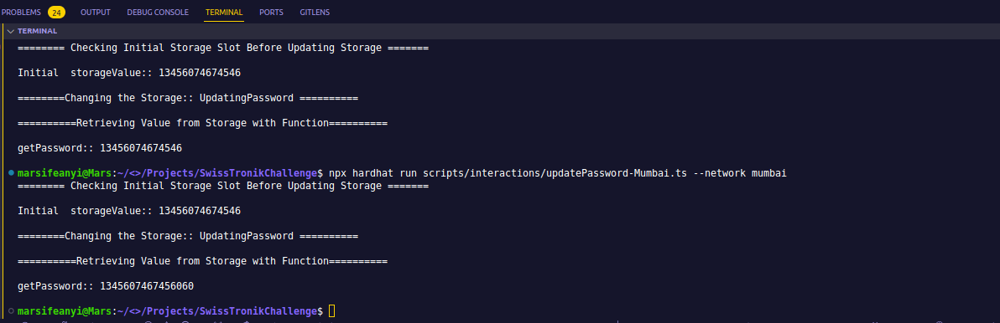
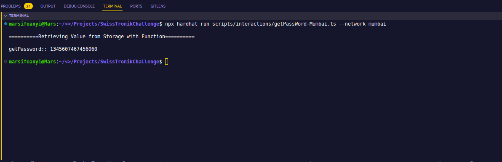
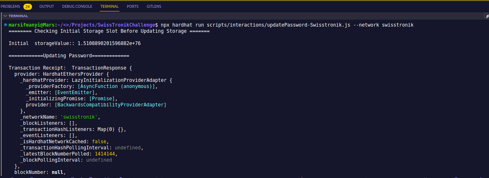
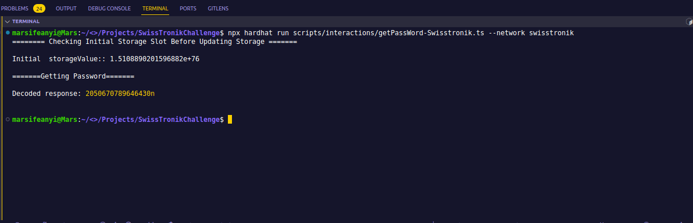

# Smart contract that stores and updates state

### Description

A smart contract that has:

- A single private state variable
- A function to set this variable with a new value that differs from the default value
- A public function to return the current value of the state variable

  ### Deployment:

  The smart contract was deployed to [Mumbai testnet](https://mumbai.polygonscan.com/address/0xaF692cd379c3B684c91bd9181A805fef3C1eE1C1) and [Swisstronik testnet](https://explorer-evm.testnet.swisstronik.com/address/0xCD6268DCb887d1d9aB0Bedcb104713679EC916C1) respectively

### Contract Address on Mumbai Testnet

- 0xaF692cd379c3B684c91bd9181A805fef3C1eE1C1

- https://mumbai.polygonscan.com/address/0xaF692cd379c3B684c91bd9181A805fef3C1eE1C1

#### Contract Address on SwissTronik

- 0xCD6268DCb887d1d9aB0Bedcb104713679EC916C1

- https://explorer-evm.testnet.swisstronik.com/address/0xCD6268DCb887d1d9aB0Bedcb104713679EC916C1

### Scripting:

- The deployment and Interaction scripts was written in Typescript and JavaScript respectively.
- The eth_getStorageAt() RPC method was called on the contract to get the value stored at slot0 (first slot)

### Script and Interactions

- Interacting with Mumbai contract and updatingPassword state, updatePassword()
  

- Retrieving value from the private storage state in the Mumbai contract, getPassword()
- 

  - Interacting with Swisstronik contract and updatingPassword state, updatePassword()
    

- Retrieving value from the private storage state in the swisstronik, getPassword()
- 
